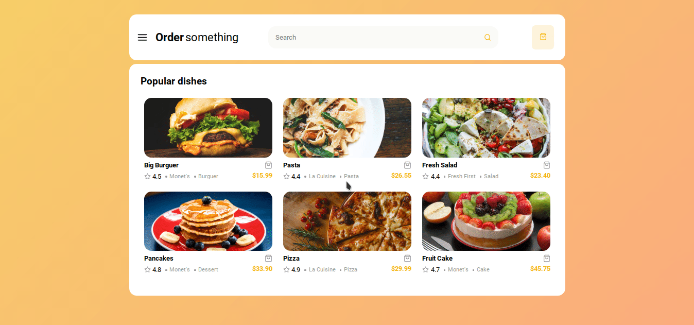

<h1 align="center">FastFood-App-Frontend</h1>

## 📝 Description

This is a simple project that i made while learn React and Redux, is a simple e-commerce interface where the user can interact with a food menu and see the total purchase price. [Live Version](https://fastfood-app-areasflavio.netlify.app)

## 👨‍💻 Technologies

This is what i used and learned with this project:

- [x] ReactJS
- [x] Styled Components
- [x] Redux
- [x] Redux-Saga
- [x] React Router
- [x] Immer
- [x] Polished
- [x] React Icons
- [x] React Redux
- [x] Reactjs Popup
- [x] Reactotron
- [x] Eslint
- [x] Prettier

---

Made by Flávio Arêas 👋 [Get in touch!](https://www.linkedin.com/in/areasflavio/)
